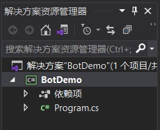
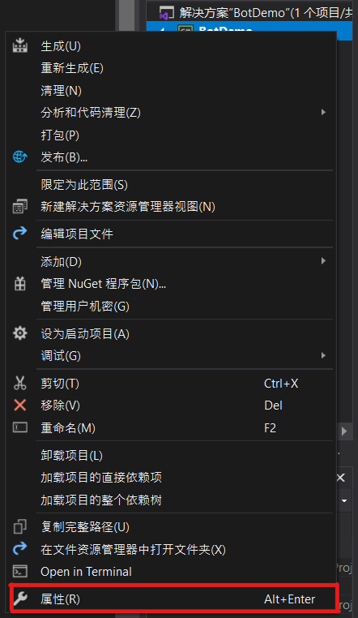
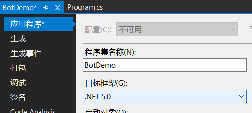
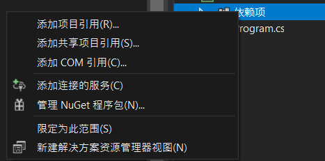
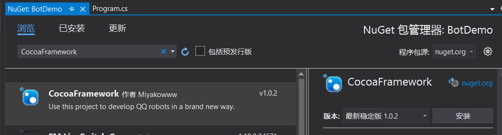
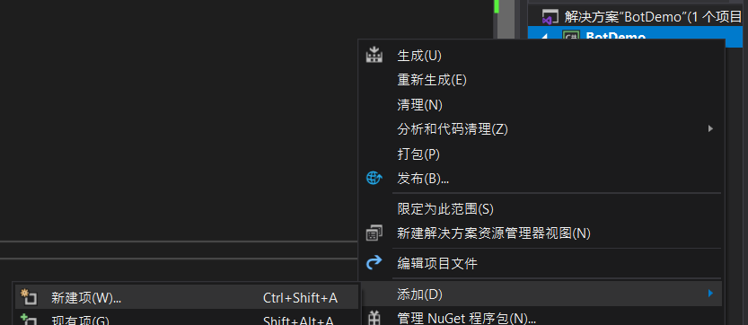
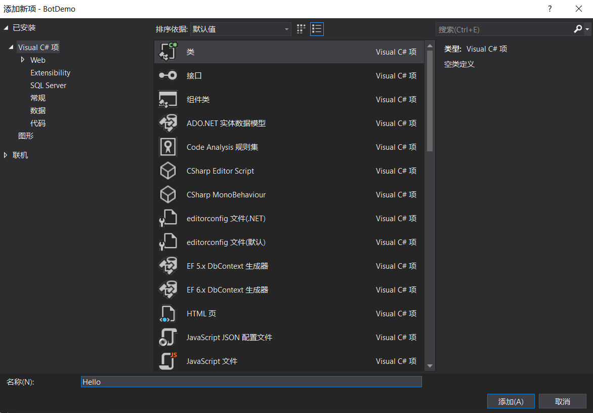

## 本教程将以 Visual Studio 为例讲解如何实现一个最简单的机器人

<br>

### 基本概念
&emsp;&emsp;一般情况下使用 QQ 与别人聊天的流程是：对方将消息输入至 QQ => QQ 发送消息至腾讯服务器 => 腾讯服务器发送消息至你的 QQ => 你的 QQ 显示消息 => 你想了想要回复什么 => 你将消息输入至 QQ => QQ 发送消息至腾讯服务器 => 腾讯服务器发送消息至对方 QQ
<br>
&emsp;&emsp;机器人需要做的是代替你完成其中的一部分操作：用户将消息输入至 QQ => QQ 发送消息至腾讯服务器 => 腾讯服务器发送消息至 Mirai => Mirai 传递至机器人 => 机器人处理消息 => 机器人将回复内容传递至 Mirai => Mirai 发送消息至腾讯服务器 => 腾讯服务器发送消息至用户 QQ
<br>
&emsp;&emsp;所以你需要 Mirai 代替 QQ 的工作，Cocoa Framework 辅助处理消息
<br><br>

#### 本教程默认你已完成 [Mirai 配置](../Preparation/SetupMirai.md)

<br>

### 创建项目
1. 开启 Visual Studio，点击 “创建新项目”
1. 此处以 “控制台应用 (.NET Core)” 为例，也可以选择其他类型，但请确保为 .NET Core 或 .NET 类型。选择完成后点击 “下一步”
1. 输入项目名称，此处以 “BotDemo” 为例，选择合适的位置，然后点击 “创建”

<br>

### 更改项目配置
1. 创建完成后右侧可以看到项目文件
<br>
1. 在项目名上右键，选择最后一项 “属性”
<br>
1. 在弹出的窗口中将目标框架更改为 “.NET 5.0”
<br>
1. Ctrl + S 保存

<br>

### 添加 NuGet 包
1. 在 “依赖项” 上右键，点击 “管理 NuGet 程序包”
<br>
1. 在 “浏览” 处搜索 CocoaFramework 并安装
<br>

<br>

### 编写启动代码
- 在自动生成的 Program.cs 文件中使用以下代码，并将其中的 host, 8080, authKey, 123456789 分别替换为之前设置的 host, port, authKey 和机器人的 QQ 号
```CSharp
using CocoaFramework.Docking;
using System;

namespace BotDemo
{
    class Program
    {
        static void Main(string[] args)
        {
            BotStartupConfig config = new BotStartupConfig("host", 8080, "authKey", 123456789);
            if (BotStartup.Start(config).Result)
            {
                Console.WriteLine("Connected");
                while (Console.ReadLine() != "exit")
                    ;
            }
            BotStartup.Dispose().AsTask().Wait();
        }
    }
}
```

<br>

### 编写模块代码
1. 在项目名上右键，添加，新建项
<br>
1. 选择 “类”，输入名称，此处以 “Hello” 为例，完成后点击 “添加”
<br>
1. 在新建的 .cs 文件中使用以下代码
```CSharp
using CocoaFramework.Core;
using CocoaFramework.Model;

namespace BotDemo
{
    [BotModule("Hello", 0, true, false)]
    public class Hello : BotModuleBase
    {
        [TextRoute("hello")]
        public void Hi(MessageSource src)
        {
            src.Send("Hi!");
        }
    }
}
```

<br>

### 运行
1. 通过快捷键 F5 运行，出现 “Connected” 表示连接成功
1. 向机器人发送 “hello” 即可收到回复 “Hi!”